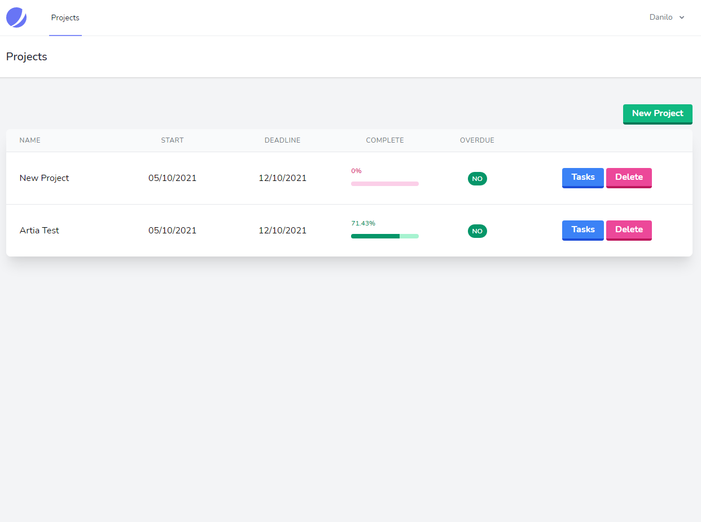
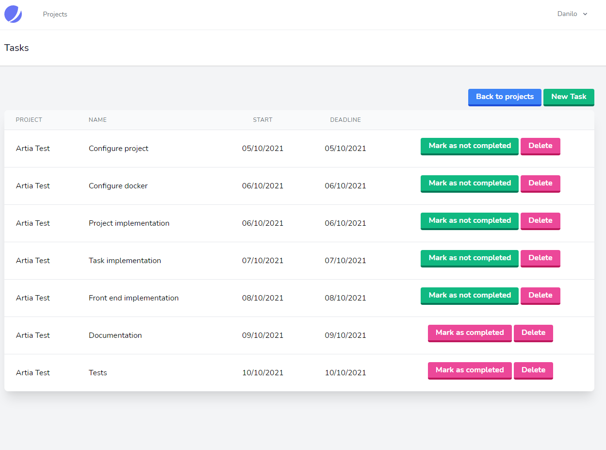

# Project Manager

This is a simple project manager designed to test your programming knowledge

## Getting started

- [How to install](#how-to-install)
    - [Install with Docker](#install-with-docker)
    - [Install on Windows](#install-on-windows)
        - [Requirements](#requirements)
        - [Installation](#installation)
- [Usage](#usage)
- [Documentation](#documentation)
  - [List Projects](#list-projects)
  - [Add new project](#add-new-project)
  - [List Projects](#list-projects)
  - [Add new task](#add-new-task)
  - [Update task status](#update-task-status)
- [Status Codes](#status-codes)
- [Technologies used](#technologies-used)

## How to install

### Install with Docker

```bash
    git clone https://github.com/dmonteirosouza/project-manager.git \
    cd project-manager \
    docker-compose up \
```

### Install on Windows

#### Requirements

- PHP >= 8.0.11
- Composer >= 2.1.9
- Mariadb >= 10.6.4
- node >= 14.18.0
- npm >= 6.14.15

### Installation

1) Go to the web server installation directory and download the project, following the image below:


3) Unzip the file *project-manager-master.zip*
3) Create a database with whatever name you prefer: e.g. project-manager
4) Edit the .env file the following items

```dotenv
DB_HOST=<YOUR HOST> #localhost
DB_PORT=<YOUR PORT> #3306
DB_DATABASE=<YOUR DATABASE> #project-manager
DB_USERNAME=<YOUR USERNAME> #root
DB_PASSWORD=<YOUR PASSWORD> #root
```
5) Open the Powershell and execute the commands below to run:

```shell
composer install
php artisan cache:clear
php artisan config:cache
php artisan migrate:fresh --seed
php artisan serve

npm install
npm run dev
```

## Usage

1) Open in your browser [http://localhost/](http://localhost/) or [http://137.184.144.231/](http://137.184.144.231/) and click in **Register**.


2) Fill the data and save.


3) On this page are listed the projects.



4) You can register a new project.


5) When you save, a message is displayed.


6) On this page are listed the tasks.



7) You can register a new task.


8) When you save, a message is displayed.


9) You can change the task status by clicking the button (yes/no).


## Documentation

You can import the [Insomnia](Insomnia.json) workspace.

### List projects
```http
curl -X GET http://localhost/api/projects
```
#### Response
```json
{
    "error": false,
    "payload": {
        "id": 1,
        "name": "New Project",
        "start": "2021-10-10",
        "finish": "2021-10-16",
        "created_at": "2021-10-10T17:15:01.000000Z",
        "updated_at": "2021-10-10T17:15:01.000000Z",
        "percent": 0,
        "deadline": false
    }
}
```

### Add new project
```http
curl -X POST -d '{"name":"New Project","start":"2021-10-08","finish":"2021-10-10"}' \
-H 'Content-Type: application/json' \
http://localhost/api/projects
```
| Parameter | Type | Description |
| :--- | :--- | :--- |
| `name` | `string` | **Required** |
| `start` | `date` | **Required** |
| `finish` | `date` | **Required**|
#### Response
```json
{
    "error": false,
    "payload": {
        "id": 1,
        "name": "New Project",
        "start": "2021-10-10",
        "finish": "2021-10-16",
        "created_at": "2021-10-10T17:15:01.000000Z",
        "updated_at": "2021-10-10T17:15:01.000000Z",
        "percent": 0,
        "deadline": false
    }
}
```

### List tasks
```http
curl -X GET http://localhost/api/projects/{project_id}/tasks
```
#### Response
```json
{
    "error": false,
    "payload": {
        "id": 9,
        "project_id": 1,
        "name": "New Task",
        "start": "2021-10-08",
        "finish": "2021-10-10",
        "status": false,
        "created_at": "2021-10-10T19:45:16.000000Z",
        "updated_at": "2021-10-10T19:45:16.000000Z",
        "project": {
            "id": 1,
            "name": "New Project",
            "start": "2021-10-10",
            "finish": "2021-10-16",
            "created_at": "2021-10-10T17:15:01.000000Z",
            "updated_at": "2021-10-10T17:15:01.000000Z"
        }
    }
}
```

### Add new task
```http
curl -X POST -d '{"name":"New Task","start":"2021-10-08","finish":"2021-10-10"}' \
-H 'Content-Type: application/json' \
http://localhost/api/projects/{project_id}/tasks
```
| Parameter | Type | Description |
| :--- | :--- | :--- |
| `name` | `string` | **Required** |
| `start` | `date` | **Required** |
| `finish` | `date` | **Required**|
| `status` | `bool` | **Optional**|
#### Response
```json
{
    "error": false,
    "payload": {
        "name": "New Task",
        "start": "2021-10-08",
        "finish": "2021-10-10"
    }
}
```

### Update task status
```http
curl -X PUT -H 'Content-Type: application/json' \
http://localhost/api/projects/{project_id}/tasks/{task_id}
```
#### Response
```json
{
    "error": false,
    "payload": true
}
```

## Status Codes

Status codes in this API:

| Status Code | Description |
| :--- | :--- |
| 200 | `OK` |
| 201 | `CREATED` |
| 202 | `ACCEPTED` |
| 204 | `NO CONTENT` |
| 400 | `BAD REQUEST` |
| 404 | `NOT FOUND` |
| 500 | `INTERNAL SERVER ERROR` |

## Technologies used

- Docker
- PHP 8
- Mariadb 10
- Vue 3
- Inertia
- Tailwindcss
